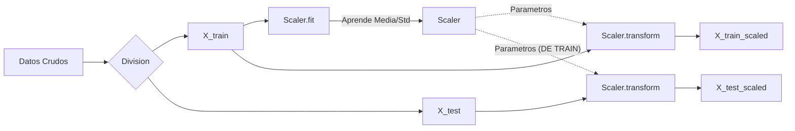

# 📊 Entendiendo StandardScaler y la Normalización de Datos

Guía detallada sobre cómo funciona `StandardScaler` en Scikit-Learn, por qué lo usamos y cómo evitar errores comunes como el _data leakage_.

---

## 1️⃣ ¿Qué es exactamente el `StandardScaler`?

**StandardScaler** es un objeto de la librería _Scikit-Learn_ que se encarga de estandarizar las características (features) de tu dataset. Su función principal es **aprender** los parámetros estadísticos de tus datos (media y desviación estándar) para escalar los valores.

### Puntos Clave:

- **No cambia tu dataset** por sí mismo _hasta_ que aplicas el método `transform()`.
- **Objetivo:** Escala los valores de cada columna para que tengan **media 0** y **desviación estándar 1**.
- **Resultado:** Centra la distribución de los datos en 0 y ajusta su dispersión.

> [!IMPORTANT]
> **No confundir con MinMaxScaler:**
> `StandardScaler` **NO** convierte los datos literalmente en un rango de 0 a 1 (eso lo hace `MinMaxScaler`).
> `StandardScaler` puede producir valores negativos y valores mayores a 1. Su objetivo es la _estandarización_, no el _acotamiento_.

---

## 2️⃣ ¿Qué es la Desviación Estándar ($\sigma$)?

La desviación estándar ($\sigma$) es una medida que indica **qué tanto se dispersan (alejan) tus datos alrededor de la media** ($\mu$).

### Ejemplo Práctico:

Imagina una columna `Glucose` (Glucosa) con valores típicos alrededor de 100, pero algunos llegan a 80 y otros a 120.

1.  **Media ($\mu$):** $\approx 100$
2.  **Desviación Estándar ($\sigma$):** Mide cuánto se alejan típicamente esos valores de 100.

### Fórmula Matemática

$$
\sigma = \sqrt{\frac{\sum(x_i - \mu)^2}{N}}
$$

- **Datos dispersos:** Mayor desviación estándar.
- **Datos concentrados:** Menor desviación estándar.

---

## 3️⃣ ¿Qué hace `fit()`?

El método `fit()` es la fase de **aprendizaje**.

```python
scaler.fit(X_train)
```

1.  **Calcula** la media ($\mu$) y la desviación estándar ($\sigma$) de cada columna numérica en `X_train`.
2.  **Guarda** estos valores internamente en el objeto `scaler` (en los atributos `.mean_` y `.scale_`).
3.  **NO transforma** nada todavía. Solo aprende los números necesarios para hacer la transformación después.

> [!WARNING]
> **Regla de Oro:**
> **NUNCA** hagas `fit()` con `X_test` ni con `y_train` (target).
>
> - `X_test`: Son datos "nuevos" simulados; el modelo no debe conocer sus estadísticas de antemano.
> - `y_train`: Es la variable objetivo, no se escala porque no es una feature de entrada.

---

## 4️⃣ ¿Por qué usamos `X_train` y no `X_test` para el fit?

Esta es una de las preguntas más importantes en Machine Learning.

- **X_train:** Son los datos que usamos para **entrenar** el modelo. Queremos que el escalador (y el modelo) aprendan "cómo es el mundo" basándose **solo** en estos datos.
- **X_test:** Representan datos **futuros/desconocidos** que queremos evaluar.

Si hacemos `fit()` sobre `X_test`, estaríamos cometiendo **Data Leakage (Fuga de Información)**. El modelo "sabría" cosas sobre la distribución del test antes de tiempo, falseando los resultados de evaluación.

**El proceso correcto es:**

1.  Aprender parámetros ($\mu, \sigma$) solo de `X_train`.
2.  Aplicar esos mismos parámetros para transformar `X_test`.

---

## 5️⃣ ¿Qué hace `transform()` y por qué se usa?

`transform()` aplica la fórmula de estandarización matemática usando la media y desviación que el scaler aprendió previamente con `fit()`.

### Fórmula de Estandarización (Z-score)

$$
X_{scaled} = \frac{X - \mu}{\sigma}
$$

### Ejemplo Numérico:

Supongamos que para la columna `Glucose`:

- Media aprendida ($\mu$) = **120**
- Desviación aprendida ($\sigma$) = **20**
- Valor a transformar ($X$) = **148**

$$
X_{scaled} = \frac{148 - 120}{20} = \frac{28}{20} = \mathbf{1.4}
$$

**Interpretación:** El valor 148 está a 1.4 desviaciones estándar por encima de la media.

- `scaler.transform(X_train)`: Aplica la estandarización al conjunto de entrenamiento.
- `scaler.transform(X_test)`: Aplica la estandarización al conjunto de prueba **usando la media y desviación de X_train**.

---

## 6️⃣ DataFrame vs Numpy Array

Un detalle técnico importante al usar Scikit-Learn:

- **Pandas DataFrame:** Estructura con nombres de columnas e índices.
- **Numpy Array:** Matriz numérica pura, pierde los nombres de columnas.

El método `StandardScaler.transform()` devuelve por defecto un **Numpy Array**.

### 💡 Tip Profesional: Mantener el DataFrame

Si quieres recuperar los nombres de las columnas e índices después de escalar:

```python
import pandas as pd

# Asumiendo que ya hiciste fit
X_train_scaled_array = scaler.transform(X_train)

# Reconstruir el DataFrame
X_train_scaled = pd.DataFrame(
    X_train_scaled_array,
    columns=X_train.columns,
    index=X_train.index
)
```

---

## 7️⃣ Resumen Gráfico Mental

| Concepto                      | Explicación Simple                                                         |
| :---------------------------- | :------------------------------------------------------------------------- |
| **Scaler**                    | Objeto que _aprende_ estadísticas para normalizar datos.                   |
| **Media ($\mu$)**             | El valor promedio de los datos.                                            |
| **Desviación std ($\sigma$)** | Qué tan dispersos están los datos alrededor de la media.                   |
| **fit()**                     | **APRENDE** $\mu$ y $\sigma$ (solo usar en `X_train`).                     |
| **transform()**               | **APLICA** la fórmula $(X - \mu) / \sigma$.                                |
| **fit_transform()**           | Atajo eficiente que hace `fit` y `transform` a la vez (solo en `X_train`). |
| **X_test**                    | **NUNCA** hacer fit. Solo `transform`.                                     |

### Flujo Correcto de Trabajo


